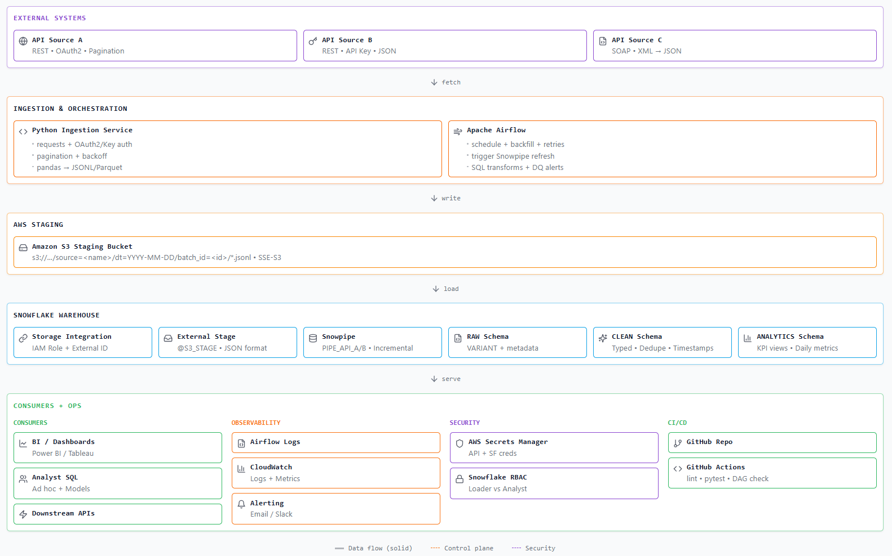

# Cloud-Native API Analytics Pipeline

A **production-grade, scalable data pipeline** that ingests data from multiple external APIs (REST with OAuth2 and API Key authentication), stages it in AWS S3, and loads it into **Snowflake** using Snowpipe for real-time analytics. Built with **Python, SQL, and cloud-based technologies**, orchestrated by **Apache Airflow**.

---

## 🎯 Project Highlights

| Requirement | Implementation |
|-------------|----------------|
| **Scalable Pipelines to Snowflake** | Multi-source ingestion with partitioned staging, Snowpipe auto-ingest |
| **REST APIs + Authentication** | OAuth2 (token refresh), API Key authentication |
| **Python Data Manipulation** | pandas, JSON processing, requests with retry/rate limiting |
| **Snowflake** | SQL transforms, Snowpipe, external stages, VARIANT parsing |
| **Cloud Platform (AWS)** | S3 staging, IAM roles, least-privilege policies |
| **Apache Airflow** | DAG orchestration, retries, failure callbacks, DQ gates |
| **Data Governance & Security** | RBAC, secrets management, encryption at rest/transit |
| **Logging & Observability** | Structured JSON logging, DQ check tables, freshness monitoring |
| **CI/CD Pipelines** | GitHub Actions for lint, test, deploy |
| **Documentation** | Architecture diagrams, data model, security docs, runbooks |

---

## 🏗️ Architecture



### Architecture Overview

| Layer | Components | Description |
|-------|------------|-------------|
| **External Systems** | API A (OAuth2), API B (API Key), API C (SOAP) | REST/SOAP APIs with various auth methods |
| **Ingestion & Orchestration** | Python Service, Apache Airflow | Fetch, transform, schedule, retry |
| **AWS Staging** | S3 Bucket | Partitioned JSONL files with SSE-S3 encryption |
| **Snowflake Warehouse** | Storage Integration, Stage, Snowpipe, RAW/CLEAN/ANALYTICS | Medallion architecture |
| **Consumers & Ops** | BI Tools, Observability, Security, CI/CD | Dashboards, logging, RBAC, GitHub Actions |

---

## 🛠️ Technology Stack

| Layer | Technologies |
|-------|--------------|
| **Data Ingestion** | Python 3.11, requests, pandas, pyarrow |
| **Authentication** | OAuth2 (client credentials), API Key, KeyPair* |
| **Cloud Storage** | AWS S3 (SSE-S3 encryption, IAM policies) |
| **Data Warehouse** | Snowflake (SQL, Snowpipe, External Stages, VARIANT) |
| **Orchestration** | Apache Airflow 2.8 (Docker) |
| **CI/CD** | GitHub Actions |
| **Observability** | Structured JSON logging, DQ check tables |
| **Testing** | pytest, pytest-cov |
| **Code Quality** | ruff, bandit (security) |

---

## 📁 Project Structure

```
├── dags/                           # Airflow DAGs
│   ├── api_to_snowflake_dag.py    # Main pipeline DAG
│   └── example_dag.py             # Verification DAG
├── src/
│   ├── auth/                      # Authentication (OAuth2, API Key)
│   │   ├── oauth2.py             # OAuth2 with automatic token refresh
│   │   └── api_key.py            # API key (header/query)
│   ├── clients/                   # API clients with production features
│   │   ├── base.py               # Base: retry, rate limiting, metrics
│   │   ├── api_a_client.py       # OAuth2 + cursor pagination
│   │   └── api_b_client.py       # API Key + offset pagination
│   ├── transform/                 # Data transformation (pandas-style)
│   │   ├── flatten.py            # JSON flattening
│   │   └── normalize.py          # Validation, deduplication
│   ├── utils/                     # Utilities
│   │   ├── s3_writer.py          # S3 staging with partitioning
│   │   ├── pipeline_logger.py    # Structured JSON logging
│   │   └── logging_config.py     # Log configuration
│   └── ingest_to_s3.py           # Main ingestion entrypoint
├── sql/                           # Snowflake SQL scripts
│   ├── 01_database_setup.sql     # DB, schemas, warehouse
│   ├── 02_storage_integration.sql # S3 ↔ Snowflake integration
│   ├── 03_stage_and_format.sql   # External stage, file format
│   ├── 04_raw_tables.sql         # RAW layer (VARIANT)
│   ├── 05_snowpipes.sql          # Snowpipe definitions
│   ├── 07_clean_tables.sql       # CLEAN layer (typed, deduped)
│   ├── 08_clean_incremental.sql  # Incremental MERGE pattern
│   ├── 09_analytics_tables.sql   # ANALYTICS views & tables
│   └── 10_data_quality_checks.sql # DQ checks with results table
├── tests/                         # Test suite (pytest)
├── docs/                          # Documentation
│   ├── architecture.md           # System design & diagrams
│   ├── data_model.md             # Schema reference
│   ├── security.md               # Security controls
│   └── runbook.md                # Troubleshooting guide
├── infrastructure/                # IAM policies
├── .github/workflows/             # CI/CD pipelines
├── docker-compose.yml             # Local Airflow environment
├── Dockerfile                     # Airflow image
└── requirements.txt               # Python dependencies
```

---

## 🚀 Quick Start

### Prerequisites

- Python 3.11+
- Docker & Docker Compose
- AWS account with S3 access
- Snowflake account

### Setup Steps

```bash
# 1. Clone repository
git clone <repository-url>
cd cloud-native-api-analytics-pipeline

# 2. Create virtual environment
python -m venv venv
source venv/bin/activate  # Windows: venv\Scripts\activate
pip install -r requirements.txt

# 3. Configure environment (copy template, fill credentials)
cp env.example .env

# 4. Setup AWS (see docs/aws-setup.md)
# - Create S3 bucket with encryption
# - Create IAM policies (least privilege)
# - Create IAM role for Snowflake

# 5. Setup Snowflake (see docs/snowflake-setup.md)
# - Run SQL scripts in order
# - Configure storage integration
# - Create Snowpipes

# 6. Start Airflow
mkdir -p logs
docker-compose up airflow-init
docker-compose up -d

# 7. Access Airflow UI: http://localhost:8080 (admin/admin)
```

---

## 📊 Data Model (Medallion Architecture)

```
RAW (Bronze)         →        CLEAN (Silver)        →      ANALYTICS (Gold)
─────────────                 ─────────────                ─────────────
VARIANT payloads              Typed columns                KPI views
As-is from API                Deduplicated                 Aggregations
Audit metadata                Standardized                 Dashboards
```

| Layer | Tables | Key Features |
|-------|--------|--------------|
| **RAW** | `API_A_EVENTS`, `API_B_EVENTS` | VARIANT column, ingestion metadata |
| **CLEAN** | `CLN_API_A_EVENTS`, `CLN_API_B_EVENTS` | Typed, `QUALIFY ROW_NUMBER()` dedupe |
| **ANALYTICS** | Views + `ANL_DAILY_SUMMARY` | Freshness, daily counts, KPIs |

### Key SQL Patterns

```sql
-- Snowpipe loading to RAW
CREATE PIPE pipe_api_a AS
COPY INTO RAW.API_A_EVENTS FROM @s3_stage_motorola/source=api_a/;

-- CLEAN layer with deduplication
SELECT payload:id::STRING AS id, ...
FROM RAW.API_A_EVENTS
QUALIFY ROW_NUMBER() OVER (PARTITION BY id ORDER BY updated_at DESC) = 1;

-- ANALYTICS freshness monitoring
SELECT source, freshness_status, event_age_minutes
FROM ANALYTICS.VW_DATA_FRESHNESS;
```

---

## 🔐 Security & Data Governance

| Control | Implementation |
|---------|----------------|
| **API Authentication** | OAuth2 (client credentials with auto-refresh), API Keys |
| **AWS IAM** | Least-privilege policies, External ID for Snowflake |
| **Snowflake RBAC** | LOADER_ROLE, TRANSFORMER_ROLE, ANALYST_ROLE |
| **Secrets Management** | Environment variables (never in code) |
| **Encryption at Rest** | SSE-S3 (AES-256), Snowflake automatic |
| **Encryption in Transit** | TLS 1.2+ for all connections |
| **Data Masking** | Snowflake masking policies (configurable) |
| **Audit Logging** | Structured logs, Snowflake ACCESS_HISTORY |

See [docs/security.md](docs/security.md) for complete security documentation.

---

## 📈 Observability & Troubleshooting

### Structured Logging

```json
{
  "timestamp": "2025-12-19T15:30:00Z",
  "level": "INFO",
  "source": "api_a",
  "batch_id": "abc123def456",
  "step": "api_fetch",
  "row_count": 500,
  "duration_ms": 1234.56,
  "retry_count": 0,
  "s3_path": "s3://bucket/source=api_a/dt=2025-12-19/..."
}
```

### Data Quality Checks

| Check | Type | Threshold |
|-------|------|-----------|
| Row Count | Completeness | > 0 |
| Null Primary Keys | Validity | = 0 |
| Freshness | Timeliness | ≤ 6 hours |
| Duplicates | Uniqueness | = 0 |

```sql
-- Monitor DQ results
SELECT check_name, table_name, passed, error_message
FROM ANALYTICS.DQ_CHECK_RESULTS
WHERE executed_at > DATEADD(HOUR, -24, CURRENT_TIMESTAMP());
```

### Troubleshooting Quick Reference

| Issue | Resolution |
|-------|------------|
| API 429 (Rate Limit) | Automatic backoff; check rate limit config |
| Auth Error | Rotate credentials; verify .env |
| Snowpipe Not Loading | `ALTER PIPE REFRESH`; check COPY_HISTORY |
| Schema Drift | Update SQL mapping; bump schema version |
| DQ Check Failed | Query DQ_CHECK_RESULTS; investigate source |

See [docs/runbook.md](docs/runbook.md) for detailed troubleshooting procedures.

---

## 🔄 CI/CD Pipeline

### Pull Request Checks

```yaml
# .github/workflows/ci.yml
- Ruff linting (Python code quality)
- Pytest with coverage
- Airflow DAG validation
- SQL syntax check (sqlfluff)
- Security scan (Bandit)
```

### Deployment

| Trigger | Environment | Actions |
|---------|-------------|---------|
| Push to `main` | Staging | Build, deploy DAGs, run migrations |
| Tag `v*` | Production | Build, deploy, create release |

---

## 🧪 Development

### Run Tests

```bash
# All tests with coverage
pytest tests/ -v --cov=src --cov-report=html

# Specific test file
pytest tests/test_transform.py -v
```

### Lint & Format

```bash
# Check
ruff check src/ tests/

# Auto-fix
ruff check --fix src/ tests/
```

### Local Ingestion Test

```bash
# Full load (all sources)
python -m src.ingest_to_s3

# Single source with debug logging
python -m src.ingest_to_s3 --source api_a --log-level DEBUG

# Incremental load
python -m src.ingest_to_s3 --since 2025-01-01T00:00:00Z
```

---

## 📚 Documentation

| Document | Purpose |
|----------|---------|
| [architecture.md](docs/architecture.md) | System design, component details, data flow |
| [data_model.md](docs/data_model.md) | Schema definitions, table structures, lineage |
| [security.md](docs/security.md) | Security controls, RBAC, encryption |
| [runbook.md](docs/runbook.md) | Troubleshooting procedures, escalation |
| [aws-setup.md](docs/aws-setup.md) | AWS S3/IAM configuration steps |
| [snowflake-setup.md](docs/snowflake-setup.md) | Snowflake setup walkthrough |
| [airflow-setup.md](docs/airflow-setup.md) | Airflow local development |

---

## 🔮 Future Enhancements

- [ ] **Snowflake UDFs** for complex parsing/normalization
- [ ] **Snowflake External Functions** for ML model scoring
- [ ] **SOAP API integration** for legacy systems
- [ ] **KeyPair authentication** for enhanced security
- [ ] **CDC with MERGE** for real-time updates
- [ ] **Cost optimization** analysis (warehouse sizing, clustering)
- [ ] **Slack/PagerDuty alerts** for pipeline failures

---

## 📄 License

[Add your license here]

---

## 🤝 Contributing

1. Fork the repository
2. Create a feature branch (`git checkout -b feature/amazing-feature`)
3. Commit changes (`git commit -m 'Add amazing feature'`)
4. Push to branch (`git push origin feature/amazing-feature`)
5. Open a Pull Request

---

*Built with Python, Snowflake, AWS, and Apache Airflow*
